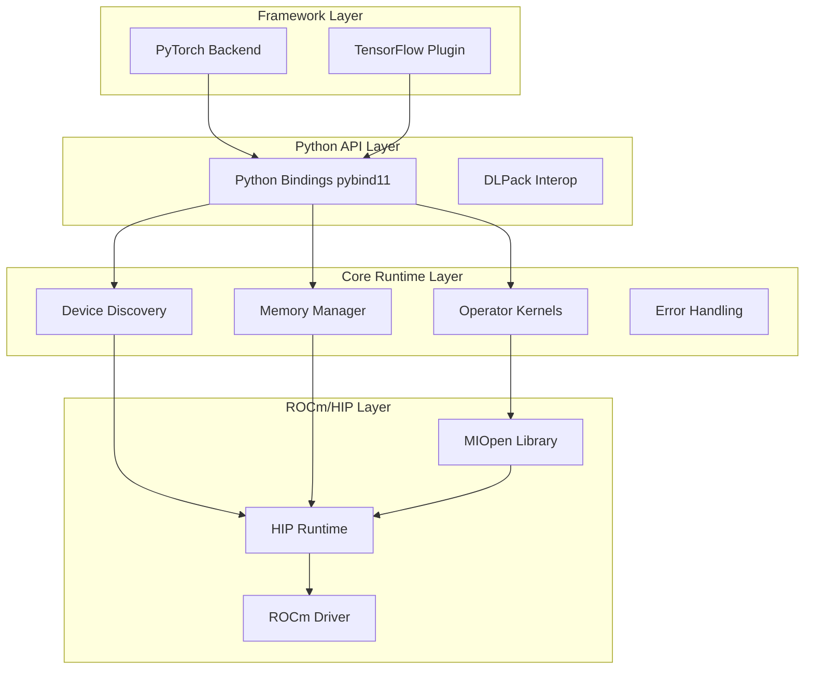

# RDNA Software Stack Design Document

## Overview
A production-quality open-source software stack enabling PyTorch and TensorFlow users to run models on AMD consumer GPUs using `device='rdna'` (analogous to `device='cuda'`).

## Target Specifications
- **Primary Hardware**: AMD RDNA consumer GPUs (RX 6800 XT, RX 7900 XTX, etc.)
- **ROCm Version**: Stable ROCm 6.x
- **Frameworks**: PyTorch and TensorFlow equally prioritized
- **License**: Apache-2.0

## Architecture Overview



## Core Components

### 1. Device Abstraction Layer (DAL)
- Device discovery and enumeration
- Context management
- Stream/queue abstraction
- Error handling wrapper

### 2. Memory Management Layer
- Caching allocator with eviction policy
- Unified memory support
- Pinned host memory
- Memory fragmentation metrics

### 3. Operator Kernel Library
- MIOpen integration for conv/GEMM
- Custom HIP kernels for missing ops
- Autotuner for algorithm selection
- Mixed-precision support (FP16/BF16)

### 4. Framework Integration
- PyTorch: Device registry, operator mappings, autograd
- TensorFlow: Device plugin, kernel registrations

### 5. Python Binding Layer
- pybind11-based bindings
- DLPack interoperability
- Diagnostic and profiling tools

## API Design

### PyTorch API
```python
# Device management
device = torch.device('rdna' if torch.rdna.is_available() else 'cpu')
torch.rdna.current_device()
torch.rdna.device_count()
torch.rdna.get_device_properties(device)

# Memory management
torch.rdna.empty_cache()
torch.rdna.memory_allocated()
torch.rdna.max_memory_allocated()

# Stream management
torch.rdna.Stream()
torch.rdna.synchronize()
```

### TensorFlow API
```python
# Device placement
with tf.device('/device:RDNA:0'):
    # TensorFlow operations

# Configuration
tf_rdna.config.set_visible_devices([0, 1])
tf_rdna.config.get_memory_info()
```

## Implementation Phases

### Phase 1: Foundation (Weeks 1-2)
- Core runtime with device discovery
- Memory manager with basic allocator
- Python bindings skeleton
- Basic build system

### Phase 2: Kernel Integration (Weeks 3-4)
- MIOpen integration for matmul/conv
- Custom HIP kernels for basic ops
- Autotuner framework
- Unit test suite

### Phase 3: Framework Integration (Weeks 5-6)
- PyTorch backend plugin
- TensorFlow device plugin
- Autograd support
- Integration tests

### Phase 4: Production Ready (Weeks 7-8)
- Performance optimization
- Packaging and distribution
- Documentation and examples
- CI/CD pipeline

## Technical Considerations

### ROCm Compatibility
- Target ROCm 6.x for latest features
- Fallback mechanisms for older versions
- Clear version requirements in documentation

### Performance Targets
- Within 5-15% of CUDA performance for key kernels
- Optimize for RDNA wavefront characteristics
- Leverage matrix cores where available

### Error Handling
- Comprehensive error messages
- Graceful fallbacks to CPU
- Diagnostic tools for troubleshooting

## Testing Strategy

### Unit Tests
- Device discovery and memory management
- Individual kernel correctness
- Error handling scenarios

### Integration Tests
- End-to-end model training
- Framework interoperability
- Multi-device scenarios

### Performance Tests
- Kernel throughput benchmarks
- Memory bandwidth tests
- Comparison against ROCm baselines

## Dependencies
- ROCm 6.x (HIP, MIOpen)
- PyTorch 2.0+
- TensorFlow 2.12+
- pybind11
- CMake 3.18+

## Risk Mitigation

### Technical Risks
- **ROCm API stability**: Use stable APIs, provide fallbacks
- **Kernel performance**: Extensive profiling and optimization
- **Framework compatibility**: Test against multiple versions

### Development Risks
- **Hardware access**: Use CI with ROCm runners for testing
- **Complexity**: Modular design with clear interfaces
- **Maintenance**: Comprehensive documentation and examples

## Success Metrics
- ✅ PyTorch ResNet50 training runs successfully
- ✅ TensorFlow BERT inference works end-to-end
- ✅ Performance within 15% of ROCm baseline
- ✅ pip/conda packages install cleanly
- ✅ Documentation enables easy adoption

## Next Steps
1. Set up project structure and build system
2. Implement core device discovery
3. Build memory management layer
4. Create Python bindings
5. Integrate MIOpen for basic operations